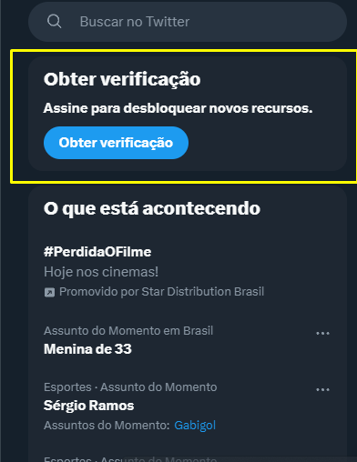

# Remover obter verificação do twitter

Extensão do Chrome para remover este elemento

## Como instalar

1. Extraia o conteúdo do arquivo ZIP para um diretório de sua escolha em seu computador.
2. Abra seu navegador (Google Chrome ou Firefox) e navegue até a página de gerenciamento de extensões: Google Chrome: digite chrome://extensions na barra de endereços. Firefox: digite about:addons na barra de endereços.
3. Ative o "Modo de desenvolvedor" na página de gerenciamento de extensões. A opção pode estar localizada em lugares diferentes, dependendo do navegador.
4. Uma vez no "Modo de desenvolvedor", clique no botão "Carregar descompactado" ou "Carregar complemento temporário". Novamente, a aparência do botão pode variar dependendo do navegador.
5. Navegue até o diretório onde você extraiu o código de extensão e selecione a pasta que contém o arquivo manifest.json.
6. Agora é só ativar a extensão.
